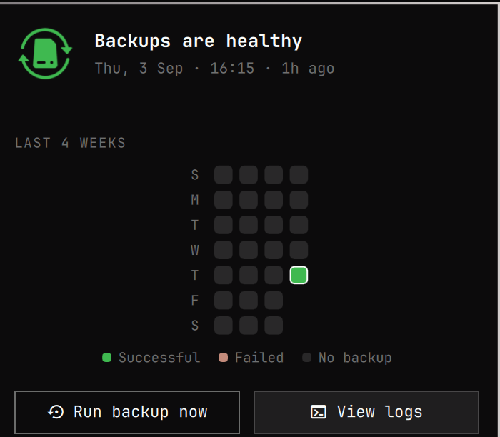
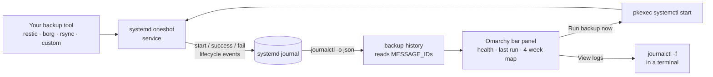
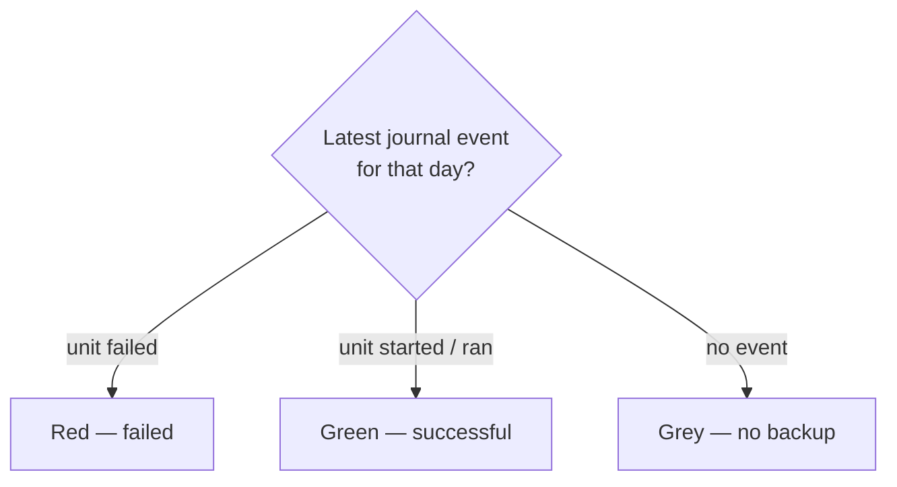

<p align="center">
  
</p>

<h1 align="center">Backup History for Omarchy</h1>

<p align="center">
  A status panel for systemd backup services in the Omarchy bar.
</p>

<p align="center">
  
</p>

## Features

- Theme-aware backup logo in the bar.
- At-a-glance health and the latest successful backup.
- Four-week, GitHub-style history of daily runs.
- Run a backup on demand through Polkit.
- Follow the service logs in a terminal.

Backup results are read from systemd's structured journal events, so the plugin never touches your backup credentials.

## How it works

The plugin is **backup-tool agnostic**. It knows nothing about restic, borg, rsync, or any specific tool — it only speaks *systemd*. Anything you can run as a systemd oneshot service works, and the journal is the single source of truth.



Each day in the map is colored from the journal, not from the tool's output:



Because detection relies on systemd's own unit lifecycle, a run that exits non-zero is recorded as `failed` by systemd and shown in red — no per-tool parsing required.

## Install

```bash
omarchy plugin add https://github.com/POSO-PocketSolutions/omarchy-backup-history.git --enable --yes
```

The default service is `restic-backup.service`. Point it at another oneshot service with:

```bash
omarchy bar set io.github.mnsosa.backup-history service your-backup.service
```

Optional settings:

```bash
omarchy bar set io.github.mnsosa.backup-history weeks 4 --json
omarchy bar set io.github.mnsosa.backup-history refreshIntervalSec 60 --json
omarchy bar set io.github.mnsosa.backup-history successColor '"#3fb950"' --json
```

The service must be managed by systemd, and its journal must be readable by the desktop user.

## Development

```bash
python -m unittest discover -s tests -v
omarchy plugin validate .
```

## License

MIT © POSO Pocket Solutions
