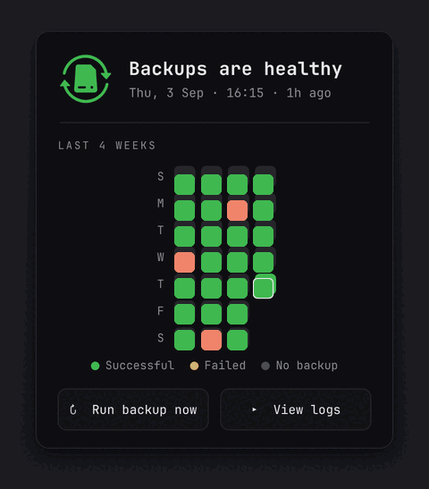
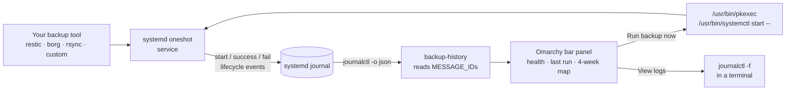
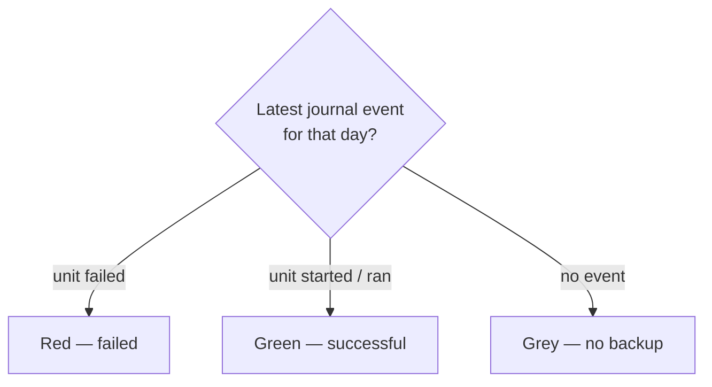

<p align="center">
  
</p>

<h1 align="center">Backup History for Omarchy</h1>

<p align="center">
  A status panel for systemd backup services in the Omarchy bar.
</p>

<p align="center">
  
  <br>
  <sub>Representative demo history.</sub>
</p>

## Features

- Theme-aware backup logo in the bar.
- At-a-glance health and the latest successful backup.
- Four-week, GitHub-style history of daily runs.
- Run a backup on demand through Polkit.
- Follow the service logs in a terminal.

Backup results are read from systemd's structured journal events, so the plugin never touches your backup credentials.

## How it works

The plugin is **backup-tool agnostic**. It knows nothing about restic, borg, rsync, or any specific tool — it only speaks *systemd*. Anything you can run as a systemd oneshot service works, and the journal is the single source of truth.



Each day in the map is colored from the journal, not from the tool's output:



Because detection relies on systemd's own unit lifecycle, a run that exits non-zero is recorded as `failed` by systemd and shown in red — no per-tool parsing required.

## Choosing a backup disk

A fresh install opens a setup wizard the first time you open the panel; **Change
backup disk** reopens it later. The wizard has four steps: choose a backup
service, choose a disk, review and apply, then verify with a test backup. You
can cancel on the first three steps.

Applying on the review step is the only point that asks for authorization. It
runs `scripts/set-target` through `pkexec`, which writes two files and reloads
systemd:

```
/etc/backup-history/target.env
/etc/systemd/system/<your-unit>.d/10-backup-history-target.conf
```

`target.env` defines `BACKUP_TARGET_UUID`, `BACKUP_TARGET_PATH`, and
`BACKUP_TARGET_LABEL`. The drop-in adds nothing but
`EnvironmentFile=-/etc/backup-history/target.env`, so your backup script reads
the target from the environment:

```bash
#!/bin/bash
set -euo pipefail
: "${BACKUP_TARGET_PATH:?no backup disk selected}"
mountpoint -q "$BACKUP_TARGET_PATH"
restic -r "$BACKUP_TARGET_PATH/restic" backup /home
```

The disk is remembered by filesystem UUID. The panel resolves that UUID to a
current mountpoint each time it refreshes and shows "Backup disk not
connected" when the UUID isn't present on the system. You can also choose a
disk that isn't mounted right now; in that case `BACKUP_TARGET_PATH` stays
empty. Backups will fail while it is empty, and mounting the disk later does
not fill it in on its own — the panel shows the disk as connected again, but
`target.env` is only rewritten when you reopen the wizard and apply once more.
Mount the disk first if you can; otherwise re-run **Apply** after mounting it.

The first step also accepts a unit name typed by hand, for a backup service
the automatic list did not offer.

The review step also has a **Forget the current disk** action, which clears
the configuration. It removes the drop-in file only when its contents are
exactly what this plugin wrote, so a drop-in you've hand-edited is left alone.

The plugin never learns what your script writes to that path — it publishes a
destination and nothing else.

## Requirements

- Omarchy with shell plugin support.
- A backup job managed by a systemd service; a oneshot service is recommended.
- Permission to read that service's journal with `journalctl`.
- `polkit`/`pkexec` for **Run backup now**. The plugin requests authorization to start only the configured service and does not install sudoers rules.
- `uwsm-app` and `xdg-terminal-exec` for **View logs**; both are part of the standard Omarchy desktop environment.

No particular backup engine is required. Restic is only the default example; borg, rsync, or a custom script work the same way when wrapped in a systemd service.

## Install

```bash
omarchy plugin add https://github.com/POSO-PocketSolutions/omarchy-backup-history.git --enable --yes
```

The default service is `restic-backup.service`. Point it at another oneshot service with:

```bash
omarchy bar set io.github.mnsosa.backup-history service your-backup.service
```

Optional settings:

```bash
omarchy bar set io.github.mnsosa.backup-history weeks 4 --json
omarchy bar set io.github.mnsosa.backup-history refreshIntervalSec 60 --json
omarchy bar set io.github.mnsosa.backup-history successColor '"#3fb950"' --json
```

The service must be managed by systemd, and its journal must be readable by the desktop user.

## Remove

```bash
omarchy plugin remove io.github.mnsosa.backup-history --yes
```

Removal deletes the installed plugin checkout. It does not modify or remove your
backup service, journal, credentials, or backup data. The target drop-in and
`target.env` are left in place; because the drop-in uses `EnvironmentFile=-`, a
missing file never fails the unit. Remove them with
`sudo rm -rf /etc/backup-history /etc/systemd/system/<your-unit>.d/10-backup-history-target.conf`
followed by `sudo systemctl daemon-reload`.

## Development

```bash
python -m unittest discover -s tests -v
omarchy plugin validate .
```

## License

MIT © POSO Pocket Solutions
